# 🛒 BazaarHub | Enterprise Multi-Vendor E-Commerce Marketplace Ecosystem

[](https://www.oracle.com/java/)
[](https://spring.io/projects/spring-boot)
[](https://angular.io/)
[](https://www.mysql.com/)
[](https://redis.io/)
[](https://min.io/)
[](https://www.docker.com/)
[](LICENSE)

**BazaarHub** is a high-performance, distributed, multi-vendor e-commerce marketplace platform engineered to seamlessly connect Customers, Independent Vendors, and System Administrators within a unified digital commerce infrastructure. 

Built on a robust decoupled architecture combining **Spring Boot 3 (Java 21)**, **Angular**, **MySQL**, **Redis**, **MinIO Object Storage**, and **WebSocket (STOMP)**, BazaarHub addresses modern scalability challenges, real-time messaging needs, secure digital wallet payment settlements via **eSewa**, and automated vendor governance workflows.

---

## 📸 Application Screenshots & File Mapping

Here is the exact mapping for saving your application screenshots into the `docs/screenshots/` directory, along with technical explanations of the UI workflows they depict:

---

### 1. 👑 Admin Platform Overview & Analytics Dashboard
<!-- SCREENSHOT PLACEHOLDER 1 -->
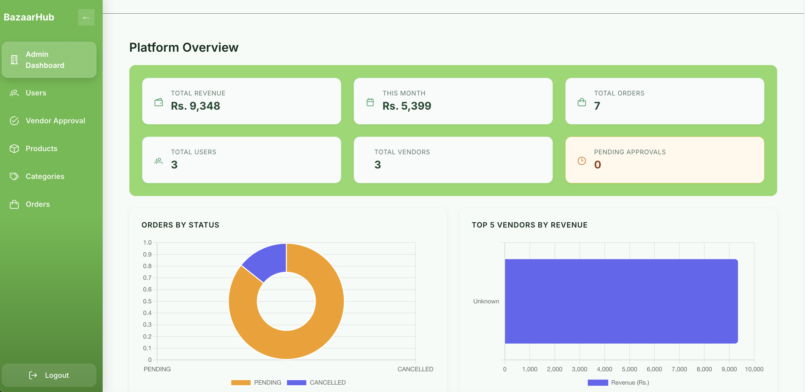
* **Technical Highlights:** Real-time revenue telemetry (`Total Revenue`, `Monthly Revenue`), vendor statistics, doughnut chart for order status breakdown (`Orders by Status`), and revenue distribution bar chart by vendor.

---

### 2. 🏪 Vendor Order Management & Fulfillment Center
<!-- SCREENSHOT PLACEHOLDER 2 -->
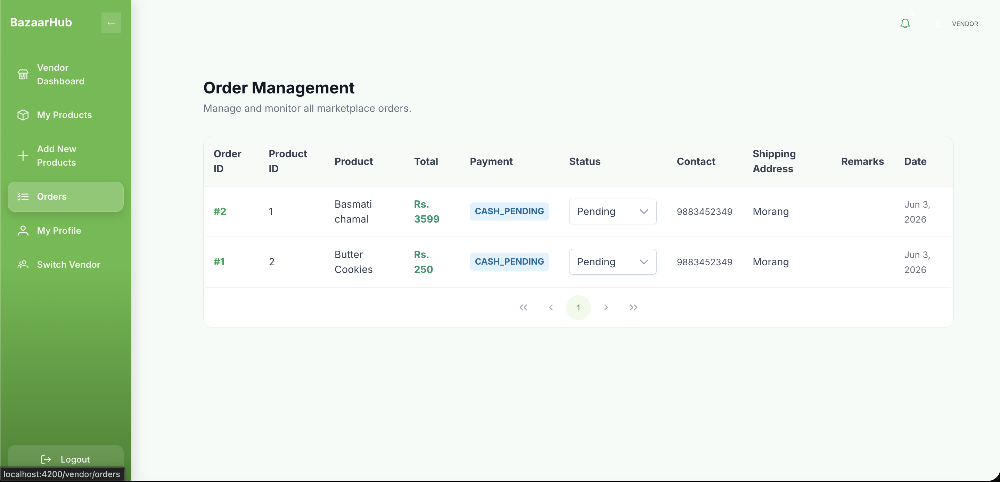
* **Technical Highlights:** Multi-tenant order list isolated per `vendor_id`, tracking line-items (`Basmati chamal`, `Butter Cookies`), `CASH_PENDING` payment states, and status dropdown selector.

---

### 3. 🔍 Storefront Search & Category Filtering
<!-- SCREENSHOT PLACEHOLDER 3 -->
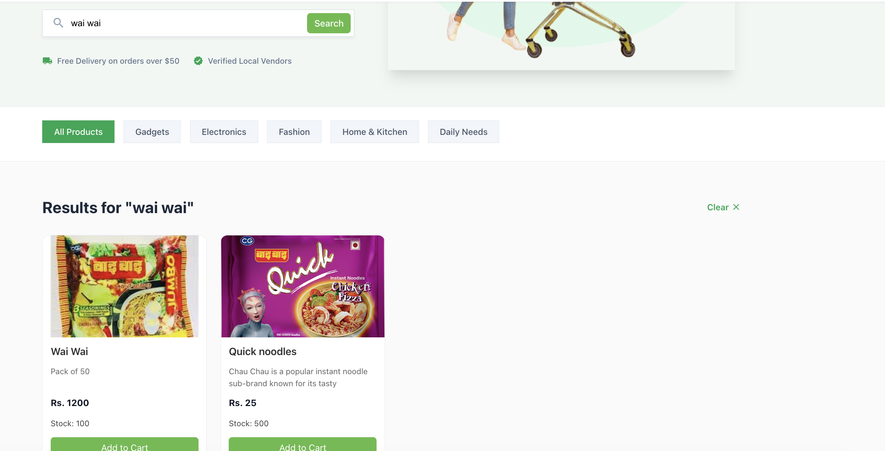
* **Technical Highlights:** High-throughput product catalog queries offloaded via **Redis key-value caching**, category filter pills, stock availability indicators, and instant reactive search.

---

### 4. 🛒 Checkout Pipeline & Shipping Address Form
<!-- SCREENSHOT PLACEHOLDER 4 -->
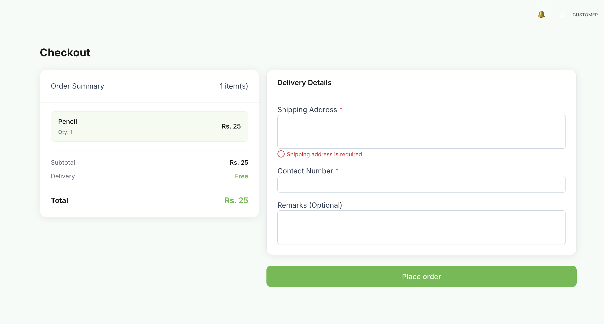
* **Technical Highlights:** Dynamic line-item calculation (`Order Summary`), mandatory shipping address validation, and atomic stock reservation prior to order creation.

---

### 5. 💳 Payment Settlement Gateway (eSewa & Cash-on-Delivery)
<!-- SCREENSHOT PLACEHOLDER 5 -->
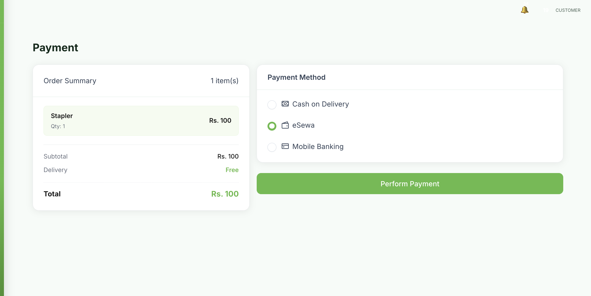
* **Technical Highlights:** Payment gateway selector supporting **eSewa digital wallet** (HMAC-SHA256 signature verification), Cash on Delivery (COD), and Mobile Banking settlement state machine.

---

### 6. 🔐 User Authentication & JWT Login
<!-- SCREENSHOT PLACEHOLDER 6 -->
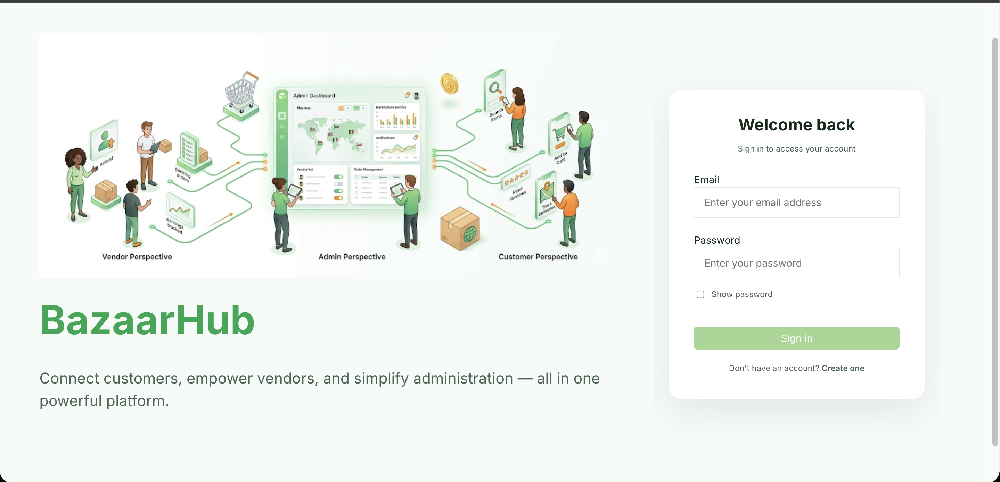
* **Technical Highlights:** Features JWT-based stateless authentication, BCrypt password hash validation, and Angular reactive forms with custom guards.

---

### 7. 📦 Vendor Product Catalog & MinIO Media Upload
<!-- SCREENSHOT PLACEHOLDER 8 -->
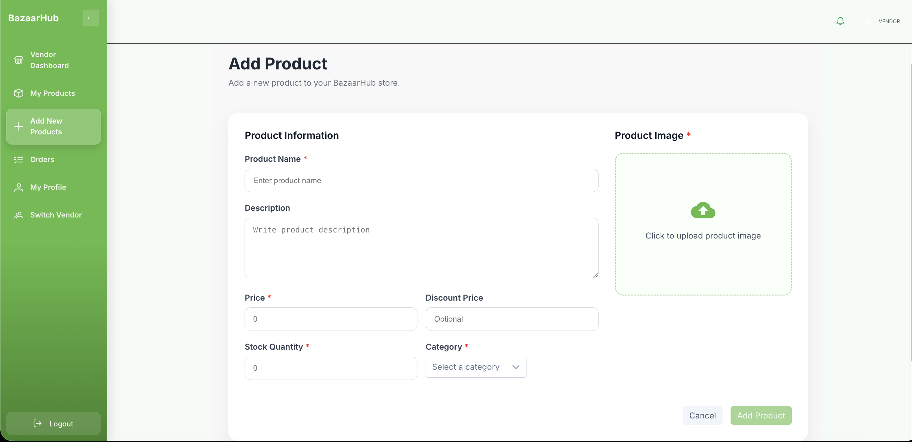
* **Technical Highlights:** Product creation & management form featuring **MinIO S3 object storage** image upload dropzone, presigned URL generation, category selection, and stock inventory controls.

---

### 8. 🔔 Real-Time WebSocket Notification Stream
<!-- SCREENSHOT PLACEHOLDER 10 -->
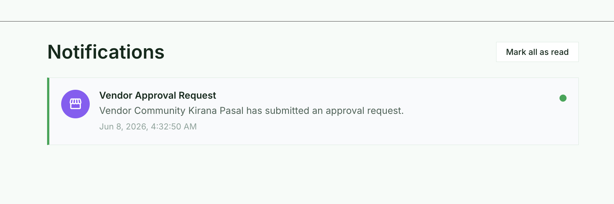
* **Technical Highlights:** Persistent STOMP over WebSocket channel delivering instant real-time toast popups and notification inbox alerts for order states, payment confirmations, and vendor approvals.

---

## 🏗️ System Architecture & Technology Stack

BazaarHub enforces a clean multi-tier architecture separating presentation, business logic, asynchronous event delivery, caching, and object storage tiers.

```
                  ┌─────────────────────────────────────────────────────────┐
                  │                 CLIENT PRESENTATION TIER                │
                  │             Angular SPA (TypeScript + PrimeNG)          │
                  └──────────────────────────┬──────────────────────────────┘
                                             │ REST API / STOMP WebSocket
                                             ▼
                  ┌─────────────────────────────────────────────────────────┐
                  │                APPLICATION BUSINESS TIER                │
                  │         Spring Boot (Spring Security + JPA/Hibernate)   │
                  └──────┬───────────────────┼───────────────────┬──────────┘
                         │                   │                   │
         ┌───────────────▼────────┐  ┌───────▼────────┐  ┌───────▼────────┐
         │     DATA STORAGE       │  │ CACHING LAYER  │  │ OBJECT STORAGE │
         │      MySQL 8.0         │  │    Redis 7     │  │     MinIO      │
         └────────────────────────┘  └────────────────┘  └────────────────┘
                         │                                       ▲
                         └───────────────► eSewa API ────────────┘
```

### 📋 Technology Matrix

| Domain | Technology / Library | Architectural Purpose & Implementation |
| :--- | :--- | :--- |
| **Frontend Framework** | `Angular` (TypeScript) | Single Page Application (SPA) architecture providing reactive state management, RxJS streams, and route protection guards. |
| **UI Components** | `PrimeNG` + `SCSS` | Enterprise-grade component library for interactive data tables, dialog modals, dynamic forms, and custom styling. |
| **Backend Core** | `Java 21` / `Spring Boot 3` | Micro-monolith backend providing high-throughput REST APIs, dependency injection, and declarative transaction management. |
| **Security & Auth** | `Spring Security` + `JWT` | Stateless JSON Web Token authentication with Role-Based Access Control (RBAC) and BCrypt password hashing. |
| **Database Tier** | `MySQL 8.0` | Relational storage for transactional integrity, foreign key constraints, and entity auditing (`createdAt`, `modifiedAt`). |
| **Caching Layer** | `Redis 7` | In-memory key-value data store reducing DB load for product catalog queries, session state, and recommendation lookups. |
| **Object Storage** | `MinIO` | Distributed S3-compatible object storage for binary media (product images, avatar uploads) via presigned URLs. |
| **Payment Gateway** | `eSewa SDK / REST` | Digital payment gateway integration with HMAC-SHA256 signature verification & Cash-on-Delivery fallback. |
| **Real-Time Stream**| `WebSocket (STOMP)` | Full-duplex persistent channel for instantaneous push notifications (order updates, vendor status updates). |
| **Containerization** | `Docker` & `Docker Compose` | Isolated multi-container deployment environment standardizing setup across backend, frontend, database, cache, and object store. |

---

## 🔥 Key Technical Features

### 🔐 1. Multi-Tenant Role-Based Access Control (RBAC) & JWT Security
* **Stateless Token Authentication**: Implements JWT authorization filters intercepting every incoming HTTP request header.
* **Role Hierarchy & Method Protection**: Fine-grained access policies for **CUSTOMER**, **VENDOR**, and **ADMIN** enforced using Spring Security's `@PreAuthorize`.
* **Adaptive BCrypt Encryption**: Hashes user passwords with dynamic salt rounds to ensure maximum credential protection.

### 🏭 2. Vendor Governance Lifecycle & Multi-Tenancy Isolation
* **Onboarding Workflow**: Strict workflow transitioning vendor accounts (`PENDING` ➔ `APPROVED` / `REJECTED`).
* **Multi-Tenant Data Scoping**: Vendors are strictly isolated, allowed only to view, manage, and fulfill orders containing products tied to their unique `vendor_id`.
* **Platform Governance**: System administrators maintain global oversight, moderation, and category mapping control over vendor listings.

### ⚡ 3. High-Throughput Redis Caching Strategy
* **Read-Heavy Query Offloading**: Frequently accessed endpoints (such as product browsing and category hierarchies) utilize Redis caching to minimize MySQL connection pool exhaustion.
* **Granular Cache Invalidation**: Automated cache eviction strategies triggered upon product creation, modification, or soft-deletion events.

### 📦 4. Presigned S3-Compatible MinIO Media Management
* **Database Blob Offloading**: Prevents relational database degradation by storing product images and user profile media directly in distributed S3-compatible MinIO object storage buckets.
* **Time-Bounded Presigned URLs**: Backend automatically issues secure, time-sensitive presigned access URLs for client-side direct uploads and fast image rendering without exposing raw storage credentials.

### 🛡️ 5. Declarative Multi-Field Validation & Data Integrity
* **Server-Side Sanitation**: Employs Bean Validation (`@NotNull`, `@Size`, `@Email`, `@Pattern`, `@NotBlank`) across all incoming request DTOs (user registration, profile setup, checkout addresses, product creation).
* **Cross-Layer Verification**: Combined Angular Reactive Form validation with Spring Security payload rejection to ensure zero unvalidated data enters business service layers.

### 🔔 6. Asynchronous Event-Driven WebSockets (STOMP Protocol)
* **Real-Time Duplex Communication**: STOMP messaging over WebSocket connections (`/topic/notifications` and `/user/queue/...`).
* **Instant System Events**: Emits real-time alerts for order state transitions (Placed ➔ Processing ➔ Shipped), vendor account approvals, and payment confirmations.

### 💳 7. Secure Payment Gateway Settlement (eSewa & COD)
* **HMAC-SHA256 Checksum Verification**: Validates transaction payloads against eSewa verification endpoints to eliminate spoofing.
* **Atomic State Machine**: Transitions order and payment statuses (`PENDING`, `COMPLETED`, `FAILED`, `CANCELLED`) atomically.

---

## 🛠️ System Design & Architecture Diagrams

### 1. Architectural Blueprint
<!-- SCREENSHOT PLACEHOLDER 6 -->
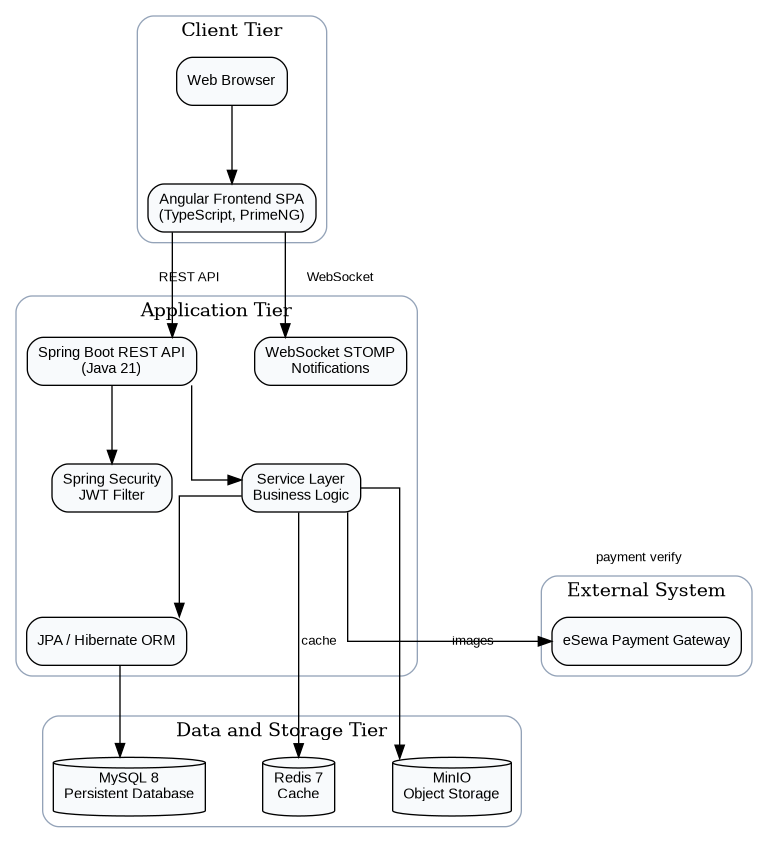

### 2. Entity Relationship Diagram (ERD) & Class Schema
<!-- SCREENSHOT PLACEHOLDER 7 -->
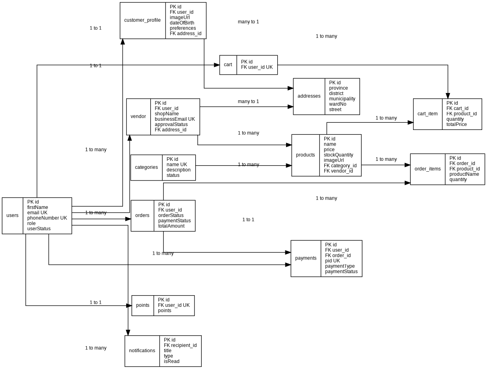

### 3. Container Deployment Topology
<!-- SCREENSHOT PLACEHOLDER 8 -->
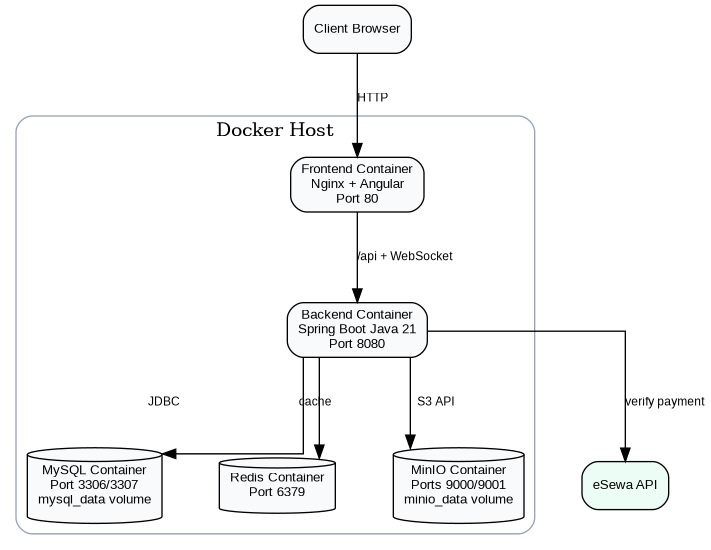

---

## 📡 Complete REST API Directory

### 🔑 Authentication & User Management
| Method | Endpoint | Description | Access Level |
| :--- | :--- | :--- | :--- |
| `POST` | `/api/register` | Register a new customer or vendor account | 🔓 Public |
| `POST` | `/api/login` | Authenticate credentials & receive JWT bearer token | 🔓 Public |
| `POST` | `/api/admin/create` | Provision administrative privileges | 🔒 Admin |
| `GET` | `/api/user/{id}` | Retrieve user profile by unique ID | 🔒 Authenticated |
| `GET` | `/api/users` | Retrieve all registered users across the platform | 🔒 Admin |
| `POST` | `/api/update-user/{id}` | Update user credentials and personal details | 🔒 Authenticated |
| `POST` | `/api/user/{id}` | Perform soft deletion of user record | 🔒 Admin |

### 🏢 Vendor Governance & Profile Management
| Method | Endpoint | Description | Access Level |
| :--- | :--- | :--- | :--- |
| `GET` | `/api/vendors` | List all verified marketplace vendors | 🔓 Public |
| `GET` | `/api/vendors/my` | Retrieve logged-in vendor's business profile | 🔒 Vendor |
| `GET` | `/api/vendor/{id}` | Fetch vendor details by vendor ID | 🔓 Public |
| `POST` | `/api/vendor/create` | Submit vendor registration application | 🔒 Authenticated |
| `POST` | `/api/vendor/update/{vendorId}`| Update vendor shop details & address | 🔒 Vendor |
| `POST` | `/api/vendor/approval/{vendorId}`| Approve or reject vendor onboarding application | 🔒 Admin |
| `POST` | `/api/vendor/delete/{vendorId}`| Soft-delete vendor marketplace store | 🔒 Admin |

### 📦 Product Catalog & Category Operations
| Method | Endpoint | Description | Access Level |
| :--- | :--- | :--- | :--- |
| `GET` | `/api/products` | Query active product catalog (Cached via Redis) | 🔓 Public |
| `GET` | `/api/products/recommended`| Fetch personalized product recommendations | 🔒 Customer |
| `GET` | `/api/product/{id}` | Retrieve detailed product specifications | 🔓 Public |
| `GET` | `/api/vendor-product/{vendorId}`| Get product listings owned by a specific vendor | 🔒 Vendor / Admin |
| `POST` | `/api/create-product` | Publish a new product with MinIO image attachment | 🔒 Vendor |
| `POST` | `/api/update-product/{productId}`| Modify product price, stock level, or details | 🔒 Vendor |
| `POST` | `/api/product/{id}` | Soft-delete product item from marketplace | 🔒 Vendor / Admin |
| `GET` | `/api/categories` | Retrieve product category tree hierarchy | 🔓 Public |
| `POST` | `/api/category` | Provision new product category | 🔒 Admin |

### 🛒 Shopping Cart & Order Processing Lifecycle
| Method | Endpoint | Description | Access Level |
| :--- | :--- | :--- | :--- |
| `GET` | `/api/cart` | Retrieve current active shopping cart items | 🔒 Customer |
| `POST` | `/api/cart/items` | Add product to customer shopping cart | 🔒 Customer |
| `POST` | `/api/cart/items/{productId}` | Update quantity for specific cart line-item | 🔒 Customer |
| `DELETE`| `/api/cart/items/{productId}` | Remove item from active cart | 🔒 Customer |
| `DELETE`| `/api/cart` | Clear entire shopping cart contents | 🔒 Customer |
| `POST` | `/api/orders/checkout` | Create order & initiate checkout pipeline | 🔒 Customer |
| `GET` | `/api/orders/{id}` | Fetch detailed order summary & status | 🔒 Authenticated |
| `GET` | `/api/orders/{id}/status` | Transition order fulfillment state | 🔒 Vendor / Admin |
| `PATCH` | `/api/orders/{id}/cancel` | Cancel order transaction | 🔒 Customer / Admin |

### 💳 Payment Settlement & Verification
| Method | Endpoint | Description | Access Level |
| :--- | :--- | :--- | :--- |
| `POST` | `/api/payment/create` | Initialize eSewa transaction request payload | 🔒 Customer |
| `GET` | `/api/payment/esewa/success`| Handle eSewa success callback & HMAC verification | 🔓 Public |
| `GET` | `/api/payment/esewa/failure`| Handle eSewa payment failure fallback | 🔓 Public |
| `POST` | `/api/payment/cash/confirm` | Confirm Cash on Delivery order payment | 🔒 Customer |
| `GET` | `/api/payments` | Audit all system payment transactions | 🔒 Admin |

---

## 💻 Getting Started & Installation Guide

### Prerequisites
Ensure your local environment meets the following requirements:
* **Java Development Kit (JDK 21+)**
* **Node.js (v18+)** & **npm**
* **Docker & Docker Compose**
* **Gradle (v8+)**

### 🚀 Docker Compose Deployment (Recommended)

1. **Clone the Repository:**
   ```bash
   git clone https://github.com/shr-gitt/BazaarHub.git
   cd BazaarHub
   ```

2. **Configure Environment File (`.env`):**
   Create a `.env` file in the project root directory:
   ```env
   # Database Configuration
   MYSQL_ROOT_PASSWORD=root_password
   MYSQL_DATABASE=bazaarhub_db
   MYSQL_USER=bazaar_user
   MYSQL_PASSWORD=bazaar_password
   
   # Redis Configuration
   REDIS_HOST=redis
   REDIS_PORT=6379
   
   # MinIO Object Storage
   MINIO_ROOT_USER=minio_admin
   MINIO_ROOT_PASSWORD=minio_secret_key
   MINIO_BUCKET_NAME=bazaarhub-media
   
   # JWT Configuration
   JWT_SECRET=404E635266556A586E3272357538782F413F4428472B4B6250645367566B5970
   JWT_EXPIRATION_MS=86400000
   
   # eSewa Payment Integration
   ESEWA_MERCHANT_CODE=EPAYTEST
   ESEWA_SECRET_KEY=8gBmUzAnchorKeySecret
   ```

3. **Build & Spin Up Docker Services:**
   ```bash
   docker-compose up -d --build
   ```

4. **Access System Endpoints:**
   * 🌐 **Angular Storefront**: `http://localhost:80`
   * ⚡ **Spring Boot REST API**: `http://localhost:8080/api`
   * 📦 **MinIO Object Console**: `http://localhost:9001`
   * 💾 **Redis Cache**: `localhost:6379`
   * 🗄️ **MySQL Database**: `localhost:3306`

---

## 🧪 Comprehensive Testing Matrix

BazaarHub underwent extensive testing across security, functional workflows, and integrations:

| Test Module | Test Case Description | Expected Result | Result |
| :--- | :--- | :--- | :---: |
| **User Registration** | Register Customer/Vendor account | Account stored with BCrypt password hash | ✅ `PASSED` |
| **Authentication** | User Login via JWT | Valid signed JWT returned on correct credentials | ✅ `PASSED` |
| **Vendor Onboarding** | Submit Vendor Registration | Vendor entity created with `PENDING` status | ✅ `PASSED` |
| **Vendor Governance** | Admin Approves Vendor | Status updated to `APPROVED`, notification sent | ✅ `PASSED` |
| **Product Management**| Add Product with Image | Asset stored in MinIO, product saved to MySQL | ✅ `PASSED` |
| **Cart Operations** | Add & Update Cart Quantities | Dynamic recalculation of order line totals | ✅ `PASSED` |
| **Checkout Workflow** | Place Order | Stock locked atomically, order created | ✅ `PASSED` |
| **eSewa Payment** | Verify Online Payment | Transaction state updated to `COMPLETED` | ✅ `PASSED` |
| **WebSockets** | Real-Time Notifications | STOMP event pushed to client notification bell | ✅ `PASSED` |
| **Order Status Update**| Vendor Updates Shipping State | Order status updated, WebSocket alert fired | ✅ `PASSED` |

## 🛣️ Future Enhancements & Scope

- [ ] **Cross-Platform Mobile App**: Develop Flutter or React Native mobile applications.
- [ ] **AI-Powered Recommendation Engine**: Transition to collaborative filtering & ML-driven personalized recommendations.
- [ ] **Advanced Vendor Analytics**: Implement real-time revenue analytics dashboards and demand forecasting.
- [ ] **Multi-Payment Gateway Expansion**: Integrate additional regional and global payment gateways (e.g. Khalti, Stripe).

---

## 📜 License

This project is licensed under the **MIT License** - see the [LICENSE](LICENSE) file for details.
